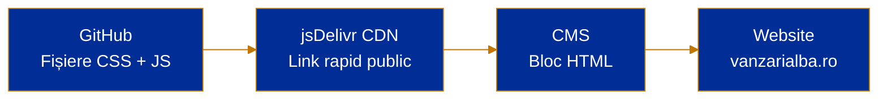
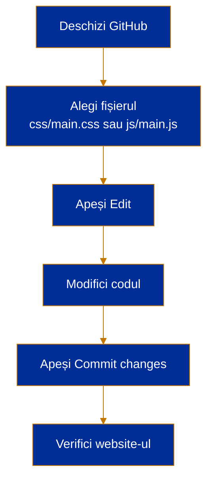
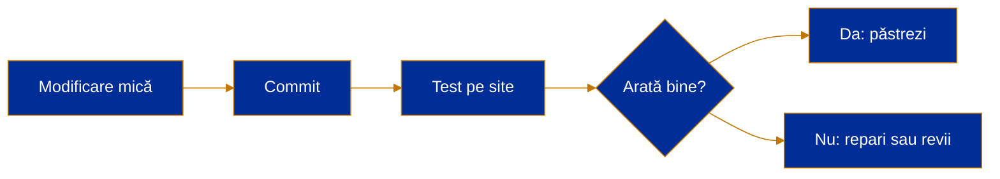
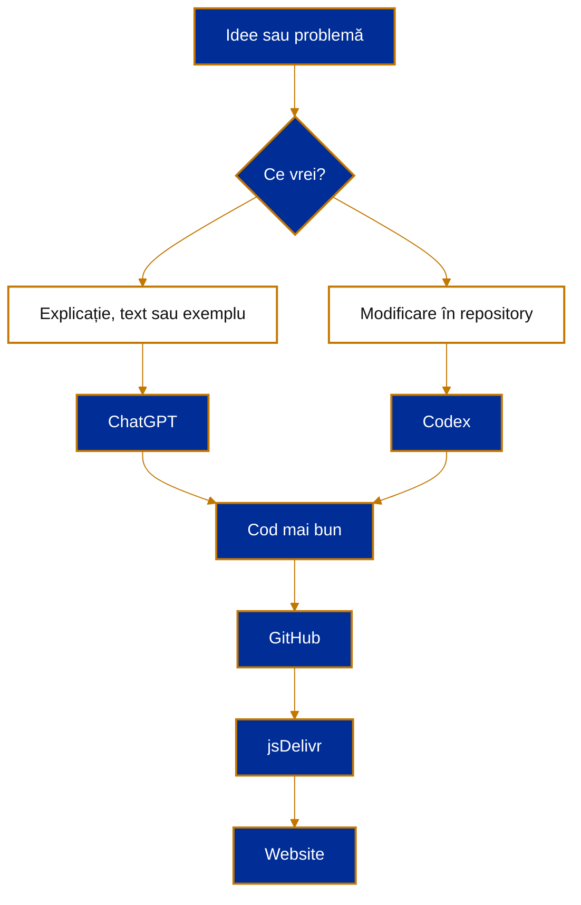
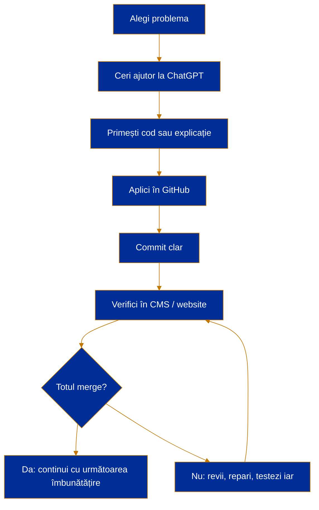

<div align="center">


# vanzarialba.ro

**Ghid practic pentru administrarea fișierelor CSS + JavaScript prin GitHub + jsDelivr CDN**


</div>

---

## 1. Ce este acest repository?

Acest repository este locul central unde ținem fișierele personalizate pentru website-ul **vanzarialba.ro**.

Website-ul folosește un CMS unde putem introduce blocuri HTML în pagini sau layout-uri. În loc să scriem cod lung direct în CMS, ținem codul curat aici, în GitHub, apoi îl încărcăm în site prin link CDN.

Pe scurt:

- **GitHub** = locul unde edităm și păstrăm codul.
- **jsDelivr CDN** = serviciul care transformă fișierele din GitHub în linkuri rapide pentru website.
- **CMS** = locul unde punem doar linkurile către fișiere, nu tot codul.
- **ChatGPT / Codex** = ajutor pentru scriere, reparare și îmbunătățire cod.

---

## 2. De ce folosim metoda asta?

Pentru că este mai curat, mai sigur și mai ușor de întreținut.

În CMS, codul devine greu de urmărit. Dacă ai multe blocuri HTML, multe scripturi și multe stiluri, te pierzi repede.

Cu GitHub + CDN:

- vezi toate modificările în istoric;
- poți reveni la o versiune veche;
- poți cere la ChatGPT sau Codex să modifice fișiere clar definite;
- nu mai copiezi cod mare prin CMS;
- site-ul încarcă fișierele direct prin CDN;
- poți lucra organizat, fără haos.

---

## 3. Structura recomandată

```text
vanzarialba.ro/
├── README.md
├── css/
│   └── main.css
└── js/
    └── main.js
```

### Explicație simplă

| Folder / fișier | Rol |
|---|---|
| `README.md` | Acest ghid. Explică cum se lucrează. |
| `css/main.css` | Stiluri: culori, butoane, spațieri, carduri, bannere. |
| `js/main.js` | Funcționalități: meniuri, efecte, butoane, interacțiuni. |

Regulă simplă:

> **HTML-ul rămâne în CMS. CSS-ul și JavaScript-ul stau în GitHub.**

---

## 4. Cum ajunge codul din GitHub în website?



Explicație:

1. Editezi fișierul în GitHub.
2. GitHub salvează versiunea nouă.
3. jsDelivr citește fișierul din GitHub.
4. CMS-ul încarcă fișierul prin link.
5. Website-ul afișează modificarea.

---

## 5. Linkuri CDN pentru acest repository

Format general:

```text
https://cdn.jsdelivr.net/gh/UTILIZATOR/REPOSITORY@BRANCH/CALE-FISIER
```

Pentru acest repository:

```text
https://cdn.jsdelivr.net/gh/cristianexer/vanzarialba.ro@main/js/main.js
```

Dacă există fișier CSS:

```text
https://cdn.jsdelivr.net/gh/cristianexer/vanzarialba.ro@main/css/main.css
```

---

## 6. Cum se adaugă fișierele în CMS

Într-un bloc HTML din CMS, adaugă aceste linii:

```html
<link rel="stylesheet" href="https://cdn.jsdelivr.net/gh/cristianexer/vanzarialba.ro@main/css/main.css">

<script src="https://cdn.jsdelivr.net/gh/cristianexer/vanzarialba.ro@main/js/main.js"></script>
```

Important:

- `link rel="stylesheet"` se folosește pentru CSS.
- `script src="..."` se folosește pentru JavaScript.
- CSS-ul trebuie pus, de regulă, înainte de conținutul paginii.
- JavaScript-ul se pune, de regulă, la finalul blocului HTML sau în zona de footer, dacă CMS-ul permite.

---

## 7. Cum modifici un fișier în GitHub



Pași:

1. Intră în repository.
2. Deschide fișierul dorit.
3. Apasă pe iconița de editare.
4. Modifică textul.
5. Apasă **Commit changes**.
6. Așteaptă câteva secunde.
7. Reîncarcă website-ul.

---

## 8. Ce înseamnă „Commit changes”?

Un **commit** este o salvare oficială în GitHub.

Gândește-l ca pe un punct de restaurare.

Exemple bune de mesaje pentru commit:

```text
Adaug stiluri pentru butoane
```

```text
Repar problema meniului pe mobil
```

```text
Actualizez scriptul pentru formular
```

```text
Schimb culorile cardurilor de proprietăți
```

Evită mesaje de tip:

```text
test
```

```text
modificare
```

```text
aaaa
```

Mesaj bun = înțelegi peste o lună ce s-a schimbat.

---

## 9. Atenție la cache CDN

jsDelivr ține fișierele în cache. Asta înseamnă că uneori modificarea nu apare instant în website.

Dacă ai modificat fișierul și website-ul încă afișează versiunea veche, folosește linkul de purge:

```text
https://purge.jsdelivr.net/gh/cristianexer/vanzarialba.ro@main/js/main.js
```

Pentru CSS:

```text
https://purge.jsdelivr.net/gh/cristianexer/vanzarialba.ro@main/css/main.css
```

După purge:

1. Deschide linkul în browser.
2. Așteaptă câteva secunde.
3. Reîncarcă website-ul cu `Ctrl + F5` sau `Cmd + Shift + R`.

---

## 10. Regula de aur pentru modificări

Nu modifica tot deodată.

Fă modificări mici:

1. o problemă;
2. un fișier;
3. un commit;
4. verificare în website.

Așa găsești repede ce a mers și ce a stricat ceva.



---

## 11. Recomandări pentru CSS

CSS-ul se folosește pentru aspect.

Exemple:

- culori;
- butoane;
- fonturi;
- spațiere;
- carduri;
- layout;
- responsive pentru mobil;
- efecte vizuale.

Exemplu simplu:

```css
:root {
  --va-blue: #002d96;
  --va-gold: #c37701;
  --va-white: #ffffff;
  --va-light: #f7f8fb;
}

.va-button {
  background: linear-gradient(135deg, var(--va-blue), var(--va-gold));
  color: var(--va-white);
  padding: 12px 18px;
  border-radius: 10px;
  text-decoration: none;
  font-weight: 700;
}
```

În HTML:

```html
<a class="va-button" href="/contact">Contactează-ne</a>
```

---

## 12. Recomandări pentru JavaScript

JavaScript-ul se folosește pentru comportament.

Exemple:

- deschidere / închidere meniu;
- scroll lin;
- afișare mesaj;
- validare formular;
- butoane interactive;
- schimbare clasă CSS;
- mici automatizări în pagină.

Exemplu simplu:

```js
document.addEventListener('DOMContentLoaded', function () {
  console.log('vanzarialba.ro scripts loaded');
});
```

Regulă:

> JavaScript-ul trebuie să ajute pagina, nu să o facă fragilă.

Dacă ceva merge perfect fără JavaScript, nu complica.

---

## 13. Convenții simple de nume

Folosește nume clare.

Bun:

```text
main.css
main.js
property-card
contact-button
hero-section
mobile-menu
```

Slab:

```text
test.css
nou.js
x1
stiluri2
scriptfinalfinal
```

Nume bun = îți spune singur ce face.

---

## 14. Cum folosești ChatGPT pentru acest repository

ChatGPT este bun pentru:

- explicat cod;
- scris CSS;
- reparat erori;
- îmbunătățit design;
- creat blocuri HTML;
- verificat cod înainte de publicare;
- simplificat cod;
- făcut text mai bun pentru website.

### Prompt 1 — explică fișierul

```text
Explică-mi pe românește ce face acest fișier. Vreau explicație simplă, pe secțiuni, fără termeni complicați.

[lipește aici codul]
```

### Prompt 2 — repară eroare

```text
Am acest cod și nu funcționează cum trebuie. Te rog să găsești problema, să explici cauza pe scurt și să-mi dai varianta corectată.

Cod:
[lipește aici codul]

Ce se întâmplă:
[descrie problema]

Ce vreau să se întâmple:
[descrie rezultatul dorit]
```

### Prompt 3 — îmbunătățește design

```text
Vreau să îmbunătățesc acest bloc HTML pentru un website imobiliar. Culorile principale sunt #002d96 și #c37701. Fă-l modern, curat, ușor de citit și bun pe mobil.

Cod actual:
[lipește aici codul]
```

### Prompt 4 — creează CSS pentru un bloc

```text
Am următorul HTML. Creează CSS separat pentru el. Vreau clase clare, design premium, responsive pe mobil, folosind #002d96 și #c37701.

HTML:
[lipește aici codul]
```

### Prompt 5 — verifică înainte de commit

```text
Verifică acest cod înainte să-l pun pe website. Spune-mi:
1. dacă are erori;
2. dacă poate strica pagina;
3. ce trebuie îmbunătățit;
4. varianta finală corectată.

Cod:
[lipește aici codul]
```

### Prompt 6 — cere modificare directă pentru GitHub

```text
Vreau să modific fișierul js/main.js din repository. Te rog să-mi dai codul complet actualizat, nu doar bucăți. Păstrează ce funcționează deja și schimbă doar ce este necesar.

Cerință:
[descrie modificarea]
```

---

## 15. Cum folosești Codex

Codex este util când vrei să lucrezi direct pe repository.

Îl poți folosi pentru sarcini mai clare, de tip:

- modifică fișier;
- creează fișier nou;
- repară bug;
- curăță cod;
- adaugă comentarii;
- organizează structura;
- verifică dacă lipsește ceva.

### Prompt bun pentru Codex

```text
Lucrează în repository-ul acesta.

Vreau să îmbunătățești website-ul vanzarialba.ro fără să schimbi structura inutil.

Cerință:
- creează sau actualizează css/main.css;
- creează sau actualizează js/main.js;
- păstrează codul simplu;
- folosește culorile #002d96 și #c37701;
- nu folosi librării externe;
- comentează secțiunile importante;
- explică la final ce ai schimbat.

Nu modifica README.md decât dacă îți cer explicit.
```

### Prompt pentru reparat bug

```text
Verifică repository-ul și caută posibile probleme în fișierele CSS și JS.

Vreau:
1. listă scurtă cu probleme găsite;
2. explicație pe românește;
3. modificări aplicate;
4. cod simplu, fără complicații.
```

### Prompt pentru design

```text
Adaugă un stil modern pentru website imobiliar.

Cerințe:
- paletă: #002d96, #c37701, alb, gri foarte deschis;
- butoane vizibile;
- carduri de proprietăți curate;
- spațiere aerisită;
- aspect bun pe mobil;
- fără framework-uri externe;
- CSS clar, cu variabile în :root.
```

### Prompt pentru siguranță

```text
Înainte să faci modificări, citește fișierele existente și spune-mi planul în 5 puncte. Nu schimba nimic până nu este clar ce vrei să modifici.
```

---

## 16. Diferența dintre ChatGPT și Codex

| Unealtă | Când o folosești |
|---|---|
| ChatGPT | Când vrei explicații, idei, texte, verificări, exemple. |
| Codex | Când vrei modificări direct în repository. |
| GitHub | Unde salvezi fișierele. |
| jsDelivr | De unde le încarcă website-ul. |
| CMS | Unde pui linkurile și blocurile HTML. |

Pe scurt:



---

## 17. Checklist înainte să publici

Înainte să salvezi modificarea:

- [ ] Am modificat doar ce trebuia?
- [ ] Codul are nume clare?
- [ ] Am verificat pe mobil?
- [ ] Am verificat în browser?
- [ ] Am folosit culorile corecte?
- [ ] Am dat un mesaj bun la commit?
- [ ] Am făcut purge la CDN dacă nu se vede modificarea?
- [ ] Am păstrat o variantă simplă?

---

## 18. Checklist după publicare

După ce modificarea este live:

- [ ] Pagina se încarcă normal.
- [ ] Nu apar erori în consolă.
- [ ] Butoanele funcționează.
- [ ] Meniul funcționează pe mobil.
- [ ] Designul arată bine pe desktop.
- [ ] Designul arată bine pe telefon.
- [ ] Nu s-a stricat altă pagină.

Cum verifici consola:

1. Deschide website-ul în Chrome.
2. Click dreapta pe pagină.
3. Apasă **Inspect**.
4. Mergi la tabul **Console**.
5. Dacă vezi roșu, este posibil să fie o eroare.

---

## 19. Cum revii la o versiune veche

GitHub păstrează istoricul.

Dacă ceva s-a stricat:

1. intră în fișier;
2. apasă pe **History**;
3. caută versiunea bună;
4. copiază codul vechi;
5. pune-l înapoi;
6. fă commit nou.

Nu intra în panică. Aproape orice modificare poate fi reparată.

---

## 20. Cum păstrezi codul simplu

Cod bun:

- este scurt;
- are nume clare;
- este împărțit pe secțiuni;
- are comentarii utile;
- nu depinde de 10 librării;
- nu face magie greu de înțeles.

Cod slab:

- are nume ciudate;
- e copiat din multe locuri;
- nu se știe ce face;
- repară o problemă și strică trei;
- are comentarii inutile;
- este prea complicat pentru ce trebuie.

Principiu:

> Dacă nu poți explica ce face codul în două propoziții, probabil trebuie simplificat.

---

## 21. Comentarii utile în cod

În CSS:

```css
/* Culori principale website */
:root {
  --va-blue: #002d96;
  --va-gold: #c37701;
}

/* Buton principal pentru acțiuni importante */
.va-button-primary {
  background: var(--va-blue);
  color: white;
}
```

În JavaScript:

```js
// Rulează codul doar după ce pagina s-a încărcat complet
document.addEventListener('DOMContentLoaded', function () {
  console.log('Pagina este gata');
});
```

Comentariile trebuie să explice **de ce**, nu fiecare detaliu evident.

---

## 22. Idei bune pentru website

### Pentru pagina principală

- banner clar cu mesaj puternic;
- buton vizibil pentru contact;
- proprietăți recomandate;
- secțiune cu beneficii;
- testimoniale;
- hartă sau zonă de acoperire;
- formular simplu.

### Pentru listări imobiliare

- carduri curate;
- preț vizibil;
- localitate vizibilă;
- suprafață / camere / teren;
- poză mare;
- buton „Vezi detalii”;
- etichetă pentru „Nou”, „Exclusiv”, „Preț redus”.

### Pentru pagina de contact

- telefon vizibil;
- WhatsApp, dacă se folosește;
- formular scurt;
- adresă;
- program;
- hartă;
- mesaj de încredere.

---

## 23. Exemple de clase CSS utile

```css
.va-section {}
.va-container {}
.va-card {}
.va-card-title {}
.va-card-meta {}
.va-button {}
.va-button-primary {}
.va-button-secondary {}
.va-badge {}
.va-hero {}
.va-grid {}
.va-contact-box {}
```

De ce prefix `va-`?

Pentru că vine de la **Vanzari Alba** și reduce riscul să se bată cu stilurile CMS-ului.

---

## 24. Model simplu pentru bloc HTML în CMS

```html
<section class="va-section">
  <div class="va-container">
    <h2>Proprietăți recomandate în Alba</h2>
    <p>Alege rapid locuința sau terenul potrivit.</p>

    <a class="va-button va-button-primary" href="/contact">
      Cere detalii
    </a>
  </div>
</section>
```

Acest bloc poate fi stilizat din `css/main.css`.

---

## 25. Model de CSS pentru blocul de mai sus

```css
.va-section {
  padding: 48px 20px;
  background: #f7f8fb;
}

.va-container {
  max-width: 1100px;
  margin: 0 auto;
}

.va-section h2 {
  color: #002d96;
  font-size: 32px;
  margin-bottom: 12px;
}

.va-section p {
  color: #333;
  font-size: 18px;
  margin-bottom: 24px;
}

.va-button-primary {
  display: inline-block;
  background: linear-gradient(135deg, #002d96, #c37701);
  color: #fff;
  padding: 12px 20px;
  border-radius: 10px;
  text-decoration: none;
  font-weight: 700;
}
```

---

## 26. Bune practici pentru website imobiliar

Un website imobiliar trebuie să fie:

- rapid;
- clar;
- credibil;
- bun pe mobil;
- ușor de contactat;
- orientat spre proprietăți, nu spre efecte inutile.

Vizitatorul vrea răspuns rapid la întrebări:

1. Ce proprietate este?
2. Unde este?
3. Cât costă?
4. Cum arată?
5. Pe cine contactez?
6. Pot avea încredere?

Designul trebuie să ajute aceste răspunsuri.

---

## 27. Culori website

Culori principale:

```css
:root {
  --va-blue: #002d96;
  --va-gold: #c37701;
  --va-white: #ffffff;
  --va-black: #111111;
  --va-light: #f7f8fb;
  --va-border: #e4e7ee;
}
```

Recomandare:

- Albastru `#002d96` pentru încredere, titluri, butoane principale.
- Auriu / portocaliu `#c37701` pentru accent, detalii, hover, elemente premium.
- Alb pentru spațiu curat.
- Gri deschis pentru fundaluri secundare.

Nu folosi prea multe culori. Două culori principale sunt suficiente.

---

## 28. Cum ceri ajutor bun de la AI

AI-ul răspunde mai bine dacă primește context clar.

Formula bună:

```text
Context:
[ce website este, ce fișier modifici, ce vrei să obții]

Cod actual:
[lipește codul]

Problemă:
[ce nu merge]

Cerință:
[ce rezultat vrei]

Constrângeri:
[nu folosi librării externe, păstrează culorile, să fie bun pe mobil]
```

Exemplu:

```text
Context:
Lucrez la website-ul vanzarialba.ro, website imobiliar. Am un bloc HTML în CMS și stilurile în css/main.css.

Problemă:
Butonul de contact nu arată bine pe mobil.

Cerință:
Vreau CSS mai bun pentru buton, cu albastru #002d96 și accent #c37701. Să fie mare, clar, modern și responsive.

Constrângeri:
Nu folosi librării externe. Dă-mi doar CSS-ul necesar.
```

---

## 29. Ce să NU faci

Evită:

- cod copiat fără să înțelegi;
- multe librării externe;
- modificări mari fără test;
- fișiere cu nume neclare;
- CSS pus peste tot în CMS;
- JavaScript inutil;
- efecte vizuale care încetinesc pagina;
- texte lungi care nu ajută vizitatorul;
- commituri fără mesaj clar.

---

## 30. Plan recomandat de lucru



---

## 31. Exemple de sarcini mici pentru început

Începe cu lucruri simple:

- schimbă stilul unui buton;
- adaugă o secțiune de contact;
- îmbunătățește cardurile de proprietăți;
- adaugă efect `hover`;
- repară spațierea pe mobil;
- creează o secțiune „De ce să alegi Vânzări Alba”;
- adaugă un mic script pentru scroll lin;
- creează clase CSS reutilizabile.

Nu începe cu modificări mari. Construiește treptat.

---

## 32. Mini-glosar

| Termen | Explicație |
|---|---|
| Repository | Folder de proiect în GitHub. |
| Branch | Linie de lucru. Aici folosim `main`. |
| Commit | Salvare oficială cu istoric. |
| CDN | Serviciu care livrează fișiere rapid către website. |
| CSS | Cod pentru design. |
| JavaScript | Cod pentru interacțiuni. |
| HTML | Structura paginii. |
| CMS | Platforma unde se administrează website-ul. |
| Cache | Copie temporară păstrată pentru viteză. |
| Purge | Ștergere cache CDN ca să apară versiunea nouă. |

---

## 33. Reguli scurte de lucru

1. Păstrează codul simplu.
2. Fă modificări mici.
3. Scrie commituri clare.
4. Testează pe mobil.
5. Nu pune tot codul în CMS.
6. Folosește ChatGPT pentru explicații.
7. Folosește Codex pentru modificări în repository.
8. Dacă nu se vede modificarea, fă purge la CDN.
9. Dacă ceva se strică, revii la versiunea veche.
10. Mai puțin cod bun este mai valoros decât mult cod confuz.

---

## 34. Linkuri importante

### JavaScript principal

```text
https://cdn.jsdelivr.net/gh/cristianexer/vanzarialba.ro@main/js/main.js
```

### CSS principal

```text
https://cdn.jsdelivr.net/gh/cristianexer/vanzarialba.ro@main/css/main.css
```

### Purge JavaScript

```text
https://purge.jsdelivr.net/gh/cristianexer/vanzarialba.ro@main/js/main.js
```

### Purge CSS

```text
https://purge.jsdelivr.net/gh/cristianexer/vanzarialba.ro@main/css/main.css
```

---

## 35. Rezumat final

Acest repository există ca să facă website-ul mai ușor de îmbunătățit.

Flux simplu:

```text
Scrii cod în GitHub → îl publici prin jsDelivr → îl legi în CMS → website-ul se actualizează
```

Când ai o idee:

1. descrie clar ce vrei;
2. cere ajutor la ChatGPT sau Codex;
3. modifică fișierul potrivit;
4. salvează cu commit clar;
5. testează pe website;
6. repetă.

<div align="center">

**vanzarialba.ro**  
*Cod mai curat. Website mai bun. Modificări mai ușor de controlat.*

</div>
